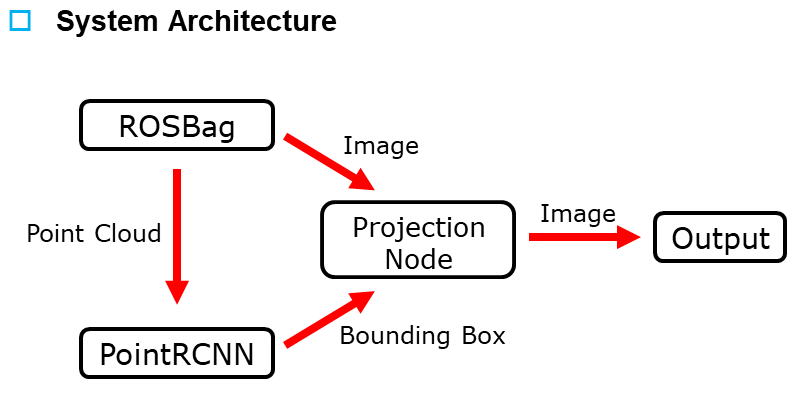

# 3D-Object-Detection_to_2D_Projection
2022년도 1학기 프로젝트  
프로젝트에 대한 내용은 아래 링크 참고.  
[프로젝트 소개 및 과정]()

---

## 🛠️환경설정 및 버전  
|환경|버전|
|:--:|:--:|
|OS|Ubuntu 20.04|
|사용언어|Python|
|IDE|VScode|
|ROS|Noetic|
|OpenCV|4.4.0|
|CUDA|11.4|
|CuDNN|8.2.4|
|NumPy|1.23.1|  

## 🛠️ROS Package  
[3D-LiDAR-Detection](https://github.com/msjun23/3D-LiDAR-Detection) : 3D LiDAR Object Detection Package  
lidar_camera : Projection Package

## 🛠️System Architecture  

  

## 🛠️Test  

  
